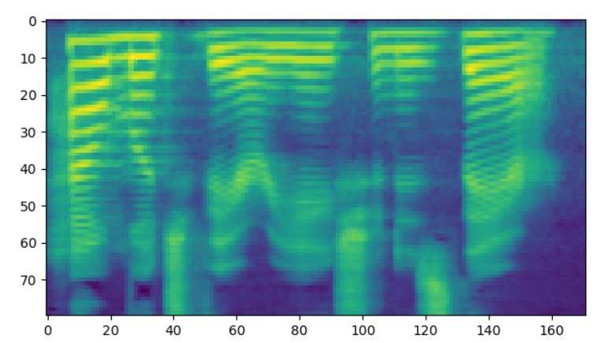
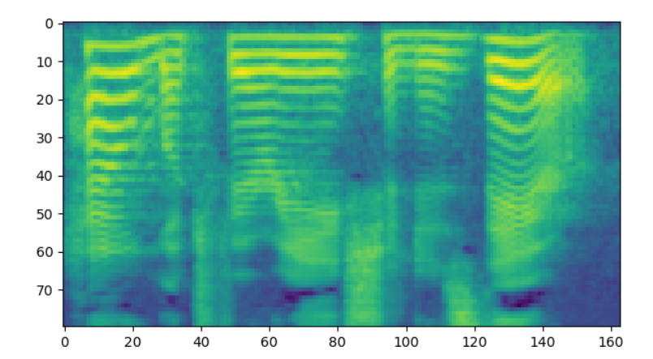
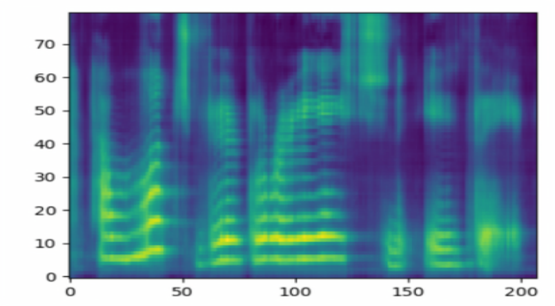
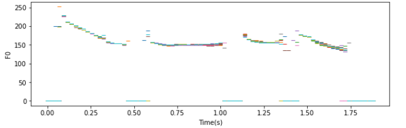
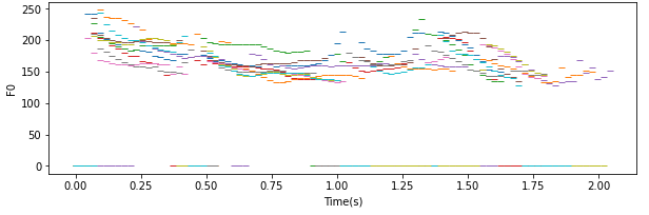
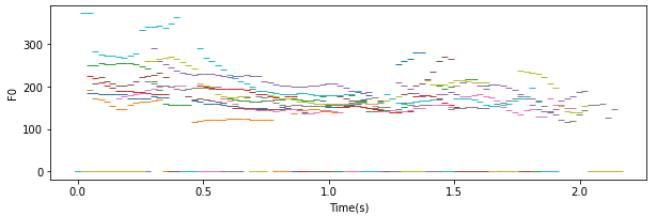
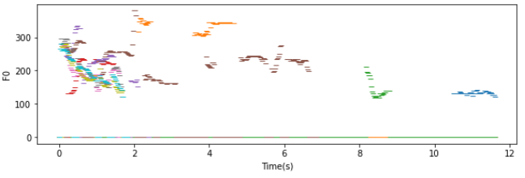

## 语音变化程度控制对比实验

### 合成样例展示

| Model     |          Condition          | Audio                                                        | Mel-spectrogram                                              |
| :-------- | :-------------------------: | :----------------------------------------------------------- | ------------------------------------------------------------ |
| Flowtron  |       $\sigma = 0.0$        | <audio controls><source src="./data/experiment1/Audio/flowtron_0.0.wav" type="audio/wav">Your browser does not support the audio element.</audio> |  |
| Flowtron  |       $\sigma = 0.5$        | <audio controls><source src="./data/experiment1/Audio/flowtron_0.5.wav" type="audio/wav">Your browser does not support the audio element.</audio> |  |
| Flowtron  |       $\sigma = 1.0$        | <audio controls><source src="./data/experiment1/Audio/flowtron_1.0.wav" type="audio/wav">Your browser does not support the audio element.</audio> |  |
| Tacotron2 | $p \in \{0.45,0.5,0.55 \} $ | <audio controls><source src="./data/experiment1/Audio/tacotron2.wav" type="audio/wav">Your browser does not support the audio element.</audio> |  |

### F0 Contours对比图

|               Condition                |                         F0 Contours                          |
| :------------------------------------: | :----------------------------------------------------------: |
|       Flowtron   $\sigma = 0.0$        |  |
|       Flowtron   $\sigma = 0.5$        |  |
|        Flowtron  $\sigma = 1.0$        |  |
| Tacotron2  $p \in \{0.45,0.5,0.55 \} $ |  |

## 样本间插值实验

