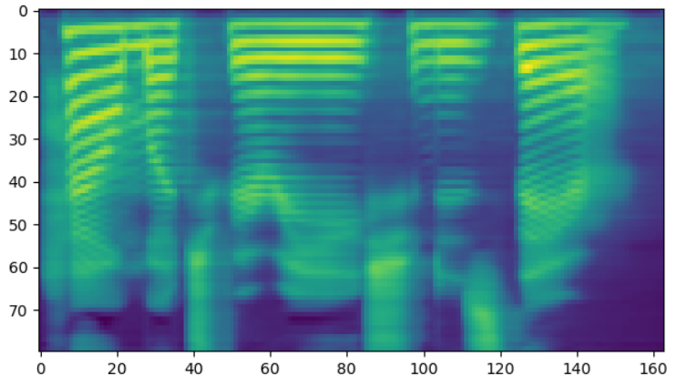

## 语音变化程度控制对比实验


### 合成样例展示

| Model     |          Condition          | Audio                                                        | Mel-spectrogram                                              |
| :-------- | :-------------------------: | :----------------------------------------------------------- | ------------------------------------------------------------ |
| Flowtron  |       $\sigma = 0.0$        | <audio controls><source src="./data/experiment1/Audio/flowtron_0.0.wav" type="audio/wav">Your browser does not support the audio element.</audio> |  |
| Flowtron  |       $\sigma = 0.5$        | <audio controls><source src="./data/experiment1/Audio/flowtron_0.5.wav" type="audio/wav">Your browser does not support the audio element.</audio> |                                                              |
| Flowtron  |       $\sigma = 1.0$        | <audio controls><source src="./data/experiment1/Audio/flowtron_1.0.wav" type="audio/wav">Your browser does not support the audio element.</audio> |                                                              |
| Tacotron2 | $p \in \{0.45,0.5,0.55 \} $ | <audio controls><source src="./data/experiment1/Audio/tacotron2.wav" type="audio/wav">Your browser does not support the audio element.</audio> |                                                              |

### There's a horizontal rule below this.

* * *

### Here is an unordered list:

*   Item foo 
*   Item bar
*   Item baz
*   Item zip

### And an ordered list:

1.  Item one
1.  Item two
1.  Item three
1.  Item four

### And a nested list:

- level 1 item
  - level 2 item
  - level 2 item
    - level 3 item
    - level 3 item
- level 1 item
  - level 2 item
  - level 2 item
  - level 2 item
- level 1 item
  - level 2 item
  - level 2 item
- level 1 item

### Small image


### Large image


### Definition lists can be used with HTML syntax.

<dl>
<dt>Name</dt>
<dd>Godzilla</dd>
<dt>Born</dt>
<dd>1952</dd>
<dt>Birthplace</dt>
<dd>Japan</dd>
<dt>Color</dt>
<dd>Green</dd>
</dl>

```
Long, single-line code blocks should not wrap. They should horizontally scroll if they are too long. This line should be long enough to demonstrate this.
```

```
The final element.
```
